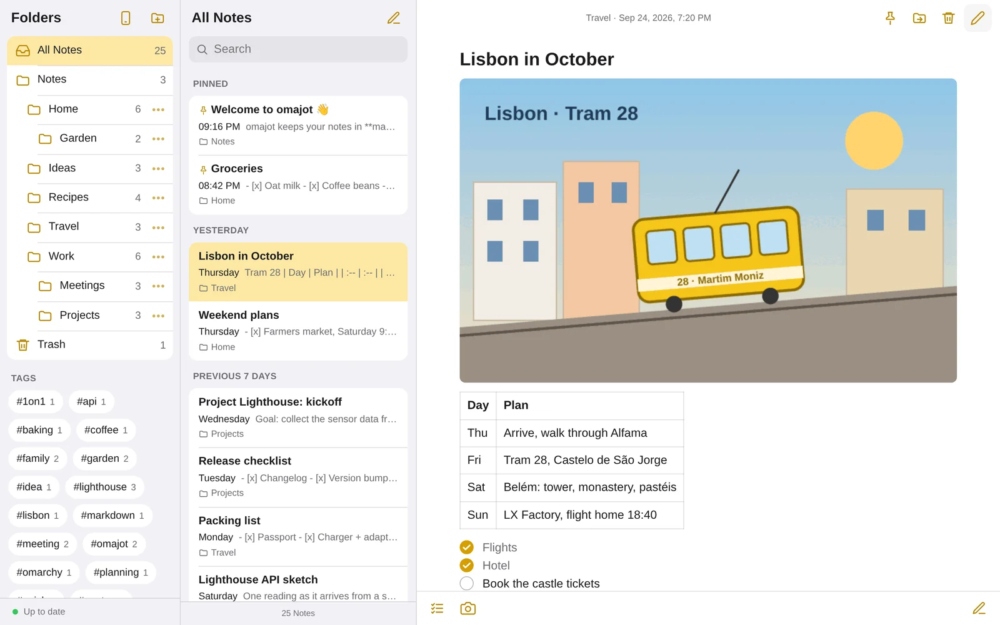
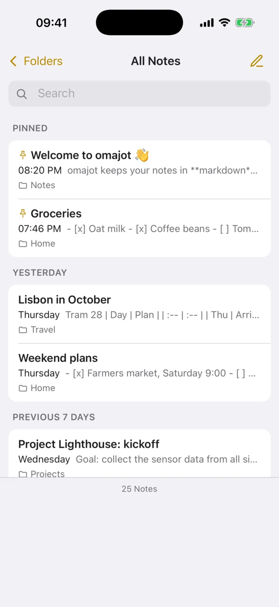
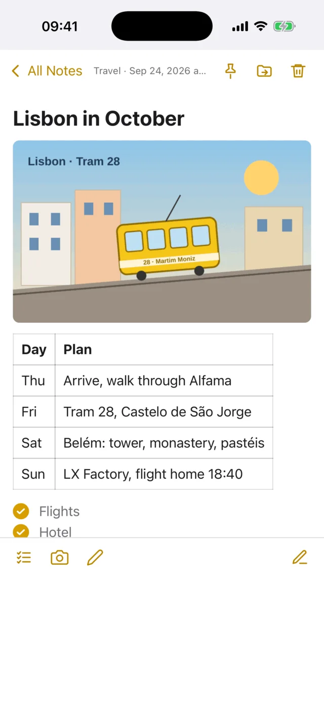
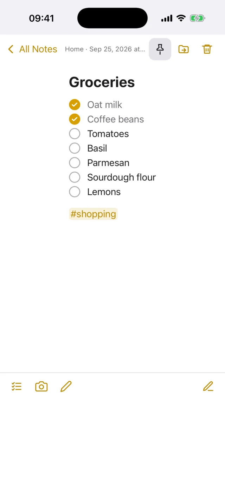
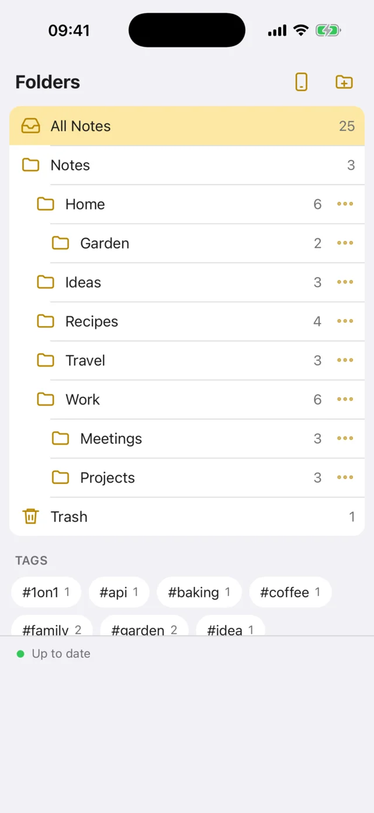
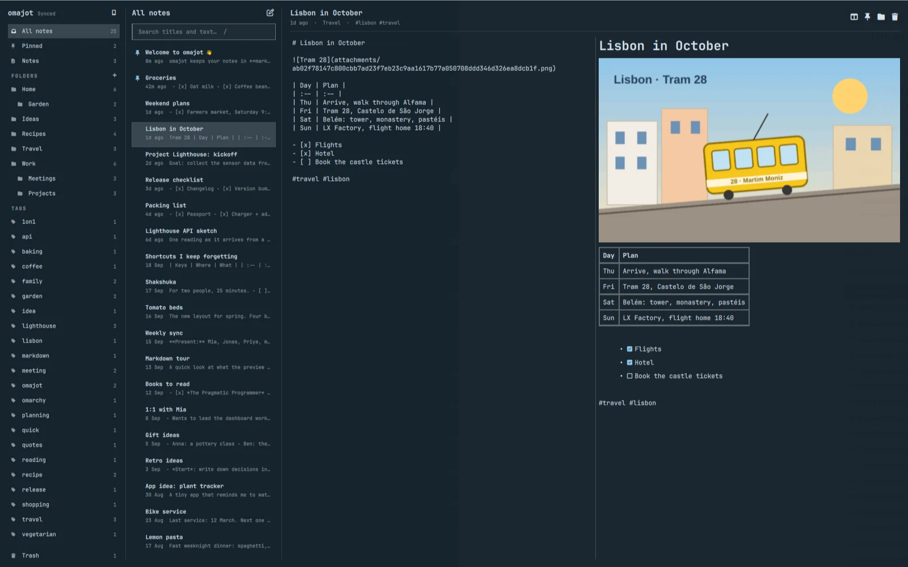
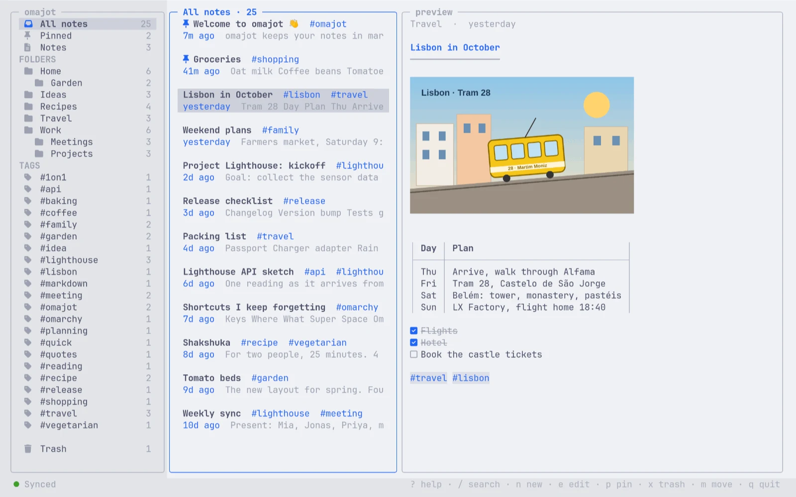

# omajot

**Your notes. Your hub. Everywhere.**

omajot is a markdown notes app in the spirit of Apple Notes. Use it in the
browser, on your phone, in the [Omarchy](https://omarchy.org/) bar, or in the
terminal. Your own small Zig hub syncs all devices over
[Tailscale](https://tailscale.com). No cloud account. No Dropbox. No conflicts.

**[Documentation](https://renerocks.ai/omajot/)** ·
**[Get started](https://renerocks.ai/omajot/get-started.html)** ·
**[Command line](https://renerocks.ai/omajot/cli.html)** ·
**[Under the hood](https://renerocks.ai/omajot/under-the-hood.html)**

<picture>
  <source media="(prefers-color-scheme: dark)" srcset="site/assets/shots/desktop-note-dark.webp">
  
</picture>

## Features

- **Markdown first.** Write plain markdown. The preview shows headings, tables,
  code, quotes, links and images. The first line of a note is its title.
- **Checklists.** Write `- [ ]`. Click the box in the preview to tick it.
- **Inline tags.** Write `#garden` anywhere. omajot lists your tags next to your folders.
- **Folders, pins and a Trash.** Nested folders. Pinned notes show first.
- **Paste anything.** Screenshots, files, web pages and LibreOffice text. Images
  become attachments. HTML becomes markdown.
- **Offline first, conflict free.** Every device keeps all notes. A CRDT, written
  in Zig, merges concurrent edits.
- **History.** Every change is kept. `omajot restore` brings back an earlier version.
- **Scriptable.** Every command has `--json`, and [SKILL.md](SKILL.md) teaches
  AI agents to use your notes.
- **Coming from Joplin?** One command imports notebooks, notes, tags and images,
  with their dates.

## Four ways to your notes

### In the browser and on your phone

The hub serves an installable web app for phones, tablets and desktop
browsers. It is a complete omajot client: you do not need Omarchy or Linux. It
starts offline and syncs in the background. Scan the QR code that the hub
prints, then tap *Share* → *Add to Home Screen*.

<p>
  <picture><source media="(prefers-color-scheme: dark)" srcset="site/assets/shots/iphone-list-dark.webp"></picture>
  <picture><source media="(prefers-color-scheme: dark)" srcset="site/assets/shots/iphone-note-dark.webp"></picture>
  <picture><source media="(prefers-color-scheme: dark)" srcset="site/assets/shots/iphone-checklist-dark.webp"></picture>
  <picture><source media="(prefers-color-scheme: dark)" srcset="site/assets/shots/iphone-folders-dark.webp"></picture>
</p>

*Safari on iOS 26 (iPhone 17 Pro simulator), with the sample notes.*

### In the Omarchy bar

The Omarchy plugin puts a note icon in the bar. Click it for a dropdown;
middle-click it for the main window. Both have three columns and full keyboard
control: <kbd>n</kbd> new note, <kbd>/</kbd> search, <kbd>j</kbd> <kbd>k</kbd>
move, <kbd>e</kbd> editor or preview.

<picture>
  <source media="(prefers-color-scheme: dark)" srcset="site/assets/shots/plugin-window-dark.webp">
  
</picture>

### In the terminal

`omajot tui` shows the same three columns in any terminal. Changes from your
other devices show up while you read. Press <kbd>e</kbd> to edit the note in
your `$EDITOR`, for example Neovim: each save goes into the note at once.
Pictures show in terminals with the Kitty graphics protocol (Ghostty, Kitty,
WezTerm). The colours come from your Omarchy theme.

<picture>
  <source media="(prefers-color-scheme: dark)" srcset="site/assets/shots/tui-dark.webp">
  
</picture>

*`omajot tui` in Ghostty. Dark: the Tokyo Night theme. Light: Catppuccin Latte.*

### On the command line

`omajot ls`, `cat`, `search`, `edit`, `append`, `export` and more: your notes
are also files for scripts and AI agents. See [Command line](#command-line).

## How it works

```
   Omarchy desktop                    always-on computer                   phone, tablet
  ┌──────────────────┐   HTTPS over   ┌───────────────────────┐   HTTPS   ┌──────────────────┐
  │ QML plugin, TUI  │   Tailscale    │ omajot hub            │           │ web app          │
  │ omajot daemon    │◀──────────────▶│ baz on bounded/http   │◀─────────▶│ core.wasm        │
  │ Zig core, native │                │ append-only log, blobs│           │ Zig core, WASM   │
  └──────────────────┘                └───────────────────────┘           └──────────────────┘
```

The hub stores and forwards changes, and it serves the web app. Every device
keeps a full copy of all notes. The same pure Zig core runs natively in the
desktop daemon and, as `core.wasm`, in the browser. Read
[Under the hood](https://renerocks.ai/omajot/under-the-hood.html) for the CRDT,
the edit transforms, and why every limit in the hub is fixed.

## Quick start

You need a Tailscale account (free for personal use) and a computer that is
always on for the hub: a Mac, a Linux computer, or a small server. The releases
have static binaries, so you do not need a compiler. The
[Get started guide](https://renerocks.ai/omajot/get-started.html) has all
details.

**1. Install omajot on the hub computer.**

```sh
brew install renerocksai/tap/omajot                  # macOS, or Linux with Homebrew
```

```sh
git clone https://github.com/renerocksai/omajot ~/omajot && ~/omajot/tools/install-release.sh   # Linux without Homebrew
```

The install script checks the SHA-256 of the download against `release.json`
and links `~/.local/bin/omajot`. On Windows (experimental), download
`omajot-x86_64-windows.exe` from the
[releases](https://github.com/renerocksai/omajot/releases).

**2. Tell the hub your Tailscale login** in `~/.config/omajot/config.json` (add
the key if the file exists already). The hub accepts requests only from this
login.

```json
{ "hub_login": "you@example.com" }
```

**3. Start the hub and publish it on your tailnet.**

```sh
brew services start omajot        # with Homebrew: a service that starts at login
tailscale serve --bg --https=8443 http://127.0.0.1:8787
```

Without Homebrew, run `omajot hub` in tmux, or as a systemd service (see
[Start the hub at boot](https://renerocks.ai/omajot/get-started.html#boot)).
The hub listens on `127.0.0.1:8787`, keeps the notes in `~/omajot-data` and
prints the phone URL with a QR code when it starts. Your hub URL is
`https://your-mac.your-tailnet.ts.net:8443`. Do not use Tailscale Funnel.

**4. Open the hub URL** in your browser and on your phone (with Tailscale).
Add it to the home screen. `omajot qr` shows the QR code again on any computer
that knows your hub.

**5. Omarchy: add the plugin**, and tell it where the hub is:

```sh
omarchy plugin add https://github.com/renerocksai/omajot --enable
```

```json
{ "hub": "https://your-mac.your-tailnet.ts.net:8443" }
```

The second block goes into `~/.config/omajot/config.json` on your Omarchy
computer. The plugin installs the omajot binary by itself and links
`~/.local/bin/omajot`, so `omajot tui` and the commands work there too.
`tools/install-app.sh` in the plugin folder adds omajot to the app launcher.

### Try it on one computer

```sh
git clone https://github.com/renerocksai/omajot && cd omajot
tools/install-release.sh
bin/omajot hub --data /tmp/omajot-demo --no-auth &
tools/seed_sample.py --data /tmp/omajot-demo-replica --hub http://127.0.0.1:8787
```

Open `http://127.0.0.1:8787`. The sample notes are in `examples/sample-notes/`.

### Coming from Joplin?

The importer needs Python 3. It reads `~/.config/joplin-desktop` and does not
change it. Run it in the plugin folder (or in your omajot clone after
`tools/install-release.sh`):

```sh
cd ~/.config/omarchy/plugins/io.github.renerocksai.omajot
tools/import_joplin.py --dry-run
tools/import_joplin.py --data ~/omajot-import
```

It sends the notes to your hub. You can run it again: it skips notes that it
imported before.

## Command line

Your notes are also in the terminal. The commands use the daemon of your data
folder (the plugin's, or one that they start in the background), and your
changes sync like changes in the plugin. Changes merge: `write`, `edit`,
`append` and `replace` apply only what is different, so an edit on your phone
at the same time stays.

| Command | What it does |
|---|---|
| `omajot ls [folder] [-r] [-l] [--tag <t>] [--trash]` | Lists notes and folders. |
| `omajot cat <note> [--at <time>]` | Writes the text of a note to stdout, also as it was at a time. |
| `omajot search <text>` | Finds the notes that contain a text. |
| `omajot new <title> [text\|-] [--folder <f>]` | Makes a note. |
| `omajot write <note> < file` | Makes stdin the text of a note (makes the note when necessary). |
| `omajot edit <note>` | Opens the note in `$VISUAL`/`$EDITOR`; every save goes into the note. |
| `omajot append <note> <text\|->` | Adds text to the end of a note. |
| `omajot replace <note> <old> <new> [--all]` | Replaces a text that occurs exactly one time (or `--all`). |
| `omajot mv <note> <folder>`, `omajot rm <note> [--restore]` | Moves a note, or moves it to the Trash and back. |
| `omajot mkdir <path>`, `omajot rmdir <folder>` | Makes or deletes a folder. |
| `omajot tags` | Lists the tags and how many notes use them. |
| `omajot history <note>`, `omajot restore <note> <version\|time>` | Lists the versions of a note; makes an earlier one the current text. |
| `omajot export <dir>` | Writes every note as `Folder/Title.md`, with its attachments. |
| `omajot status` | Shows the daemon, the data folder and the sync state. |
| `omajot tui` | Browse, search and edit your notes in the terminal: folders and tags, the notes, the note. Edits go through `$VISUAL`/`$EDITOR`. |
| `omajot hub [--login <you>] [--port 8787] [--data <dir>] [--url <url>]` | Runs the hub and serves the web app. Defaults come from `hub_login`, `hub_port` and `hub_data` in the config file. Prints its phone URL and a QR code at start. |
| `omajot daemon [--hub <url> \| --no-hub] [--data <dir>] [--socket <path>]` | The local copy that the plugin and the commands use. |
| `omajot qr [url]` | Prints a URL (default: your hub) as a QR code in the terminal. |

Address a note as `Folder/Title` (the title is the first line), `Title`, or its
id. Every command has `--help` with examples, and `--json` for scripts. Exit
codes: 0 done, 1 not found, 2 ambiguous, 3 conflict, 64 usage, 69 no daemon,
70 other error. For AI agents: [SKILL.md](SKILL.md).

```sh
omajot new "Groceries" "- milk" --folder Home
omajot append Home/Groceries "- eggs"
omajot edit Home/Groceries
omajot ls -r --json | jq -r '.notes[].path'
```

Command-line flags come first, then `~/.config/omajot/config.json`, then the
defaults. See the [CLI reference](https://renerocks.ai/omajot/cli.html).

## Platforms

| Platform | Binary |
|---|---|
| Linux x86_64, aarch64 | Static (musl). No shared libraries. |
| macOS arm64, x86_64 | Native. |
| Windows x86_64 | Experimental. It builds natively on bounded/http's IOCP backend. We did not run it as a hub yet. Tailscale for Windows supports `tailscale serve`. |

The web app runs in the browser on every platform.

## Build from source

omajot needs Zig 0.16.0 exactly.

- Omarchy and Arch Linux: `omarchy pkg add zig`. Arch ships Zig 0.16.0 today.
  If Arch has a newer Zig, install 0.16.0 with mise: `mise use -g zig@0.16.0`.
- macOS: download Zig 0.16.0 from [ziglang.org](https://ziglang.org/download/),
  or use mise: `mise use -g zig@0.16.0`.
- Do not use `omarchy-install-dev-env zig`. It installs the latest Zig, and a
  newer Zig cannot build omajot.

For the plugin, build in the plugin folder that `omarchy plugin add` made, and
restart the shell:

```sh
cd ~/.config/omarchy/plugins/io.github.renerocksai.omajot
zig build -Doptimize=ReleaseSafe
omarchy restart shell
```

Development:

```sh
zig build                 # zig-out/bin/omajot (Linux: static, musl)
zig build -Doptimize=ReleaseSafe -Dstrip=true   # the release build, about 3.5 MB
zig build test            # core, hub and daemon tests
zig build wasm            # zig-out/web/core.wasm
npm test                  # plugin model tests (+ a Qt JS engine smoke test)
cd web && npm ci && npm run build && npm test && npm run e2e
python3 tools/build_site.py   # the documentation site, into _site/
```

`web/dist/` is committed, so `zig build` needs no Node.js. The build embeds it
into the binary; `omajot hub --web web/dist` serves the folder instead while
you work on the web app.

## Documentation

- [Get started](https://renerocks.ai/omajot/get-started.html)
- [Using omajot](https://renerocks.ai/omajot/using.html)
- [Command line](https://renerocks.ai/omajot/cli.html)
- [Under the hood](https://renerocks.ai/omajot/under-the-hood.html)
- [DESIGN.md](DESIGN.md): the decisions and why.
- [docs/PROTOCOL.md](docs/PROTOCOL.md): the client protocol, the hub API and the core API.

## License

MIT. See [LICENSE](LICENSE).
